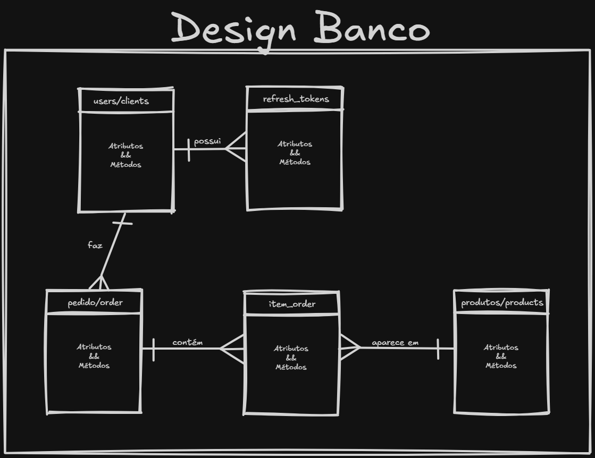
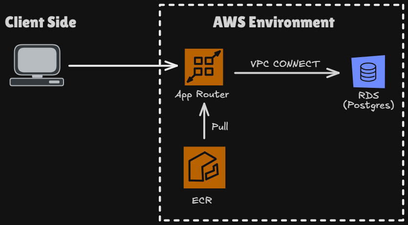

<div align="center">

# TECHMART

API interna de uma loja virtual: catálogo, vendas e controle de estoque à prova de concorrência.

<br />


</div>

<br />

## Sobre o projeto

> A **TechMart** é uma loja virtual em fase inicial que precisava de um sistema para gerenciar produtos e vendas sem os erros de estoque e conflitos de venda que planilhas manuais provocam. Este repositório é a primeira versão da API interna dessa loja: **vendedores** gerenciam o catálogo e acompanham vendas, **clientes** visualizam produtos e compram.

O coração do projeto não é o CRUD, e sim o que acontece **sob concorrência**. Dois clientes comprando o último item ao mesmo tempo, um vendedor tentando excluir um produto no exato instante em que ele é vendido: são esses os pontos em que um sistema ingênuo quebra. A TechMart empurra cada uma dessas garantias para o banco de dados, onde elas realmente se sustentam.

> O repositório é um **monorepo fullstack**. O backend (TechMart API) está implementado e documentado; o frontend (WorldScope) faz parte do mesmo desafio e está mapeado ao final deste documento.

---

## Stack

<div align="center">


</div>

<br />

| Camada | Tecnologia | Papel |
|---|---|---|
| **Linguagem** | TypeScript | Tipagem estática ponta a ponta, do schema à rota |
| **Runtime** | Node.js 22 | Execução via `tsx` (sem build intermediário em dev) |
| **HTTP** | Express 5 | Roteamento, middlewares e encaminhamento automático de erros async |
| **Banco** | PostgreSQL 16 | Persistência e garantias de concorrência (locks, constraints) |
| **ORM** | Drizzle ORM | Query builder tipado; SQL explícito onde a concorrência exige |
| **Validação** | Zod | Schemas de entrada por rota, tipos inferidos via `z.infer` |
| **Auth** | JWT + bcrypt | Access token curto + refresh token rotacionado (SHA-256) |
| **Testes** | Vitest | Unitários com repositório fake + integração de concorrência |
| **Monorepo** | pnpm workspaces | Um pacote por domínio, cada um dono da sua fatia do schema |
| **Infra** | Docker · AWS App Runner · RDS · Terraform | Container + Postgres gerenciado, infraestrutura como código |

---

## Arquitetura

O monorepo é dividido em **pacotes pnpm**, cada um dono exclusivo de uma fatia do schema e das regras associadas. Dentro de cada pacote de domínio, a divisão é por camada: `route → controller → service → repository`, com validação Zod resolvida antes do controller.

> Um pacote de domínio **nunca escreve na tabela de outro**. Mesmo quando uma operação cruza fronteira, como uma compra que decrementa estoque, quem conhece o SQL daquela tabela continua sendo o pacote dono dela.


| Pacote | Responsabilidade |
|---|---|
| **`packages/db`** | Cliente Postgres e schema Drizzle; exporta o tipo `Transaction` para escrita atômica cross-pacote |
| **`packages/shared`** | `AppError` e subclasses, envelope de erro `{ error: { message, details? } }`, middleware `validate(schema)` |
| **`packages/auth`** | Tabelas `users` e `refresh_tokens`; cadastro, login, rotação de token, middleware de autenticação e papel |
| **`packages/products`** | Tabela `products`; CRUD, flag `already_sold` e `decrementStock(tx, ...)`, única função que escreve estoque |
| **`packages/orders`** | Tabelas `orders` e `order_items`; fluxo de compra (orquestra a transação) e painel do vendedor |
| **`apps/api`** | Monta os routers de `auth`, `products` e `orders` e registra o error handler global |

---

## Modelo de dados

Quatro tabelas de domínio (`users`, `products`, `orders`, `order_items`) mais `refresh_tokens` para a rotação de sessão. Valores monetários usam `numeric(10,2)`, que o Drizzle devolve como **string**, evitando erro de ponto flutuante em dinheiro.



<br>

> **Preços congelados no histórico.** `orders.total_amount` e `order_items.unit_price` guardam o valor **no momento da compra**. Preços mudam; o histórico financeiro não pode ser recalculado retroativamente.

> **`products.already_sold` é permanente.** A flag nasce `false` e vira `true` na primeira venda e nunca volta atrás, mesmo que o estoque seja reposto. É ela que impede a exclusão de um produto que já teve venda.

---

## Concorrência: o ponto central

> Quase toda race condition tem a mesma forma: você **lê** um estado, **decide** com base nele e **escreve**, mas entre a leitura e a escrita outra requisição mudou o estado. A decisão foi tomada com informação já velha.

O caso clássico é o **overselling**: dois clientes comprando 4 unidades de um estoque de 5, ambos lendo `stock = 5` antes de qualquer escrita, e ambos passando na checagem. A versão ingênua vende 8 de um estoque de 5.

A solução adotada é um **UPDATE condicional atômico**, com a guarda no `WHERE`, não no JavaScript:

```sql
UPDATE products SET stock = stock - $qty
WHERE id = $id AND stock >= $qty
RETURNING *;
```

> Como é um único statement, não existe "valor em memória" para ficar velho. O Postgres serializa a linha e re-avalia a condição contra a versão já atualizada, e o vão entre ler e escrever **desaparece**. Um segundo cliente sem estoque recebe **0 linhas afetadas** e leva um `409`.

A mesma filosofia se repete em toda a base:

| Risco | Garantia no banco |
|---|---|
| Overselling na compra | `UPDATE ... WHERE stock >= qty` (decremento atômico) |
| Estoque negativo por bug futuro | `CHECK (stock >= 0)` no schema |
| Excluir produto já vendido | `DELETE ... WHERE already_sold = false` |
| Deadlock em pedido multi-item | Itens ordenados por `product_id` antes de travar |
| Deadlock de pool de conexões | Transação curta; leituras de validação ficam **fora** dela |

---

## Deploy na AWS

A API sobe como um container que fala com um Postgres gerenciado. O objetivo é uma **URL HTTPS pública** com o menor atrito possível, sem administrar servidor, TLS ou balanceador na mão.



| Componente | Papel | Por quê |
|---|---|---|
| **App Runner** | Roda o container e expõe HTTPS | TLS, autoscaling e health check gerenciados; zero servidor para administrar |
| **RDS Postgres 16** | Banco gerenciado | Backups e patching sem operar Postgres na mão; mesma versão do local (paridade dev/prod) |
| **ECR** | Registro da imagem Docker | App Runner puxa a imagem daqui; scan de vulnerabilidade no push |
| **VPC Connector** | Egress do App Runner para a VPC | Alcança o RDS **privado** sem expor o banco à internet |
| **Terraform** | Infraestrutura como código | Recriar ou destruir tudo é um comando; o avaliador lê a infra como código |

> **Segredos gerados, não digitados.** A senha do RDS e o `JWT_SECRET` nascem de `random_password` no Terraform, sem nenhum segredo commitado. As migrations rodam no start do container (`db:migrate && start`), de forma idempotente.

O passo a passo completo (runbook, custo, teardown e hardening) vive em [`knex-backend-case/DEPLOY.md`](./knex-backend-case/DEPLOY.md).

---

## Como rodar

> Pré-requisitos: **Node.js 22+**, **pnpm** e **Docker** (para o Postgres local).

```bash
cd knex-backend-case

pnpm install                       # instala o workspace
docker compose up -d db            # sobe o Postgres 16
cp .env.example .env               # configura as variáveis

pnpm db:migrate                    # aplica as migrations
pnpm dev                           # API em http://localhost:3000
```

Verificando que está no ar:

```bash
curl http://localhost:3000/health
# {"status":"ok"}
```

Rodando os testes:

```bash
pnpm test               # unitários (repositório fake, sem banco)
pnpm test:integration   # concorrência real (exige o Postgres)
```

> O **teste de concorrência** é o showcase: dispara N compras em paralelo de um produto com estoque limitado e prova que o estoque nunca fica negativo e que só o número certo de compras passa. Ele **falha** na versão ingênua e **passa** na atômica.

---

## Rotas da API

**Autenticação**

| Método | Rota | Descrição |
|---|---|---|
| `POST` | `/auth/register` | Cadastro (informando `role`: `customer` ou `seller`) |
| `POST` | `/auth/login` | Login e emissão do par access + refresh token |
| `POST` | `/auth/refresh` | Rotação do refresh token |

**Produtos**

| Método | Rota | Descrição | Acesso |
|---|---|---|---|
| `GET` | `/products` | Listar produtos | Cliente e vendedor |
| `GET` | `/products/:id` | Detalhar produto | Cliente e vendedor |
| `POST` | `/products` | Criar produto | Somente vendedor |
| `PUT` | `/products/:id` | Editar produto | Somente vendedor |
| `DELETE` | `/products/:id` | Excluir (se nunca vendido) | Somente vendedor |

**Compras e vendas**

| Método | Rota | Descrição | Acesso |
|---|---|---|---|
| `POST` | `/orders` | Realizar uma compra | Somente cliente |
| `GET` | `/orders` | Listar compras do cliente autenticado | Cliente |
| `GET` | `/seller/sales` | Todos os pedidos da loja | Vendedor |
| `GET` | `/seller/sales/:product_id` | Histórico de vendas de um produto | Vendedor |

> Toda a API responde erro no formato único `{ error: { message, details? } }`. Erros de negócio viram o status adequado (`409` para conflito de estoque, `403` para papel indevido); `ZodError` vira `400` com `details`.

---

## Estrutura do repositório

```
knex-PS-26.2/
├── knex-backend-case/     # TechMart API (implementado)
│   ├── apps/api/          # bootstrap Express
│   ├── packages/          # auth · products · orders · db · shared
│   ├── infra/             # Terraform (App Runner + RDS + ECR)
│   └── doc/adr/           # decisões arquiteturais registradas
├── knex-frontend-case/    # WorldScope (planejado)
└── README.md              # este arquivo
```

---
